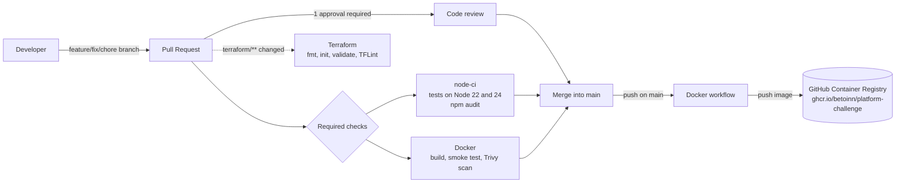

# DevOps Platform Challenge

A small Node.js task API used to practise a complete, professional delivery workflow:

**Issue → Branch → Pull Request → Review → CI → Merge → Container image → Infrastructure validation**

The application itself is intentionally simple. The focus of the project is the platform around it: GitHub collaboration rules, automated quality gates, container publishing and Terraform validation.

## Table of contents

- [Architecture](#architecture)
- [API](#api)
- [Local setup](#local-setup)
- [Tests and linting](#tests-and-linting)
- [Docker](#docker)
- [CI/CD](#cicd)
- [Terraform](#terraform)
- [Development workflow](#development-workflow)
- [Useful commands](#useful-commands)
- [Project structure](#project-structure)

## Architecture



| Component | Technology | Location |
|---|---|---|
| API | Node.js, Express | `src/app.js` |
| Tests | Node.js built-in test runner (`node:test`) | `test/` |
| Container | Docker, multi-stage build on `node:24-alpine` | `Dockerfile` |
| CI/CD | GitHub Actions | `.github/workflows/` |
| Infrastructure as code | Terraform (validation only, no cloud provider) | `terraform/` |

Tasks are stored in memory: they are reset every time the application restarts.

## API

The application listens on port `3000` (configurable with the `PORT` environment variable).

| Method | Route | Description | Responses |
|---|---|---|---|
| `GET` | `/` | Service information | `200` |
| `GET` | `/health` | Health check, used by Docker | `200` |
| `GET` | `/total` | Total of a sample basket | `200` |
| `GET` | `/tasks` | List all tasks | `200` |
| `POST` | `/tasks` | Create a task from `{ "title": "..." }` | `201`, `400` if the title is empty |
| `PATCH` | `/tasks/:id` | Update a task with `{ "completed": true }` | `200`, `400` if the input is invalid, `404` if the task does not exist |

A task looks like this:

```json
{ "id": 3, "title": "Write the README", "completed": false }
```

Examples:

```bash
curl http://localhost:3000/tasks

curl -X POST http://localhost:3000/tasks \
  -H "Content-Type: application/json" \
  -d '{"title": "Review pull request"}'

curl -X PATCH http://localhost:3000/tasks/3 \
  -H "Content-Type: application/json" \
  -d '{"completed": true}'
```

## Local setup

Requirements:

- Node.js 22 or 24
- npm
- Docker (optional, to run the container)
- Terraform 1.5 or later (optional, to validate the configuration locally)

```bash
git clone https://github.com/Betoinn/platform-challenge.git
cd platform-challenge
npm ci
npm start
```

The API is then available at <http://localhost:3000>.

## Tests and linting

```bash
npm test        # runs every *.test.js file in test/
npm run lint    # ESLint
```

| Test file | Covers |
|---|---|
| `test/app.test.js` | `calculateTotal` |
| `test/tasks.test.js` | `GET /tasks` |
| `test/tasks.create.test.js` | `POST /tasks` |
| `test/tasks.update.test.js` | `PATCH /tasks/:id` |

API tests start the Express app on a random port and send real HTTP requests with `fetch`.

## Docker

Build and run the image locally:

```bash
docker build -t devops-platform-challenge .
docker run --rm -p 3000:3000 devops-platform-challenge
```

Or run the image published by the CI:

```bash
docker run --rm -p 3000:3000 ghcr.io/betoinn/platform-challenge:latest
```

How the image is built:

- **Multi-stage build**: the first stage installs production dependencies with `npm ci --omit=dev`; the final image only receives `node_modules`, `package.json` and `src/`.
- **No npm in the final image**: npm is not needed at runtime and was the source of every HIGH vulnerability reported by Trivy, so it is removed.
- **Non-root user**: the container runs as the unprivileged `node` user.
- **Health check**: Docker calls `/health` every 30 seconds.
- **`.dockerignore`** keeps tests, Git history, Terraform files and documentation out of the build context.

## CI/CD

Three GitHub Actions workflows live in `.github/workflows/`.

### `node-ci.yml`

Runs on every pull request to `main` and on every push to `main`.

1. Check out the code
2. Install Node.js (matrix: **22** and **24**) with npm caching
3. `npm ci`
4. `npm test`
5. `npm audit --audit-level=high`

### `docker.yml`

Runs on pull requests to `main`, pushes to `main` and `v*` tags.

1. Build the image with Buildx (layer cache stored in GitHub Actions)
2. Smoke test: start the container and wait for `/health` to answer
3. Scan the image with Trivy; the job fails on any fixable HIGH or CRITICAL vulnerability
4. *(not on pull requests)* Log in to GHCR with `GITHUB_TOKEN`
5. *(not on pull requests)* Push the image

Pull requests only build and check the image. Published tags:

| Event | Tags |
|---|---|
| Push to `main` | `latest`, `main`, `sha-<commit>` |
| Git tag `v1.2.3` | `1.2.3`, `sha-<commit>` |

### `terraform.yml`

Runs only when files under `terraform/` (or the workflow itself) change. See [Terraform](#terraform).

### Branch protection and quality gate

`main` is protected:

- no direct pushes, for everyone including administrators;
- a pull request with **at least 1 approval** is required;
- required status checks: `build (22)`, `build (24)` and `build-and-push`.

If a test fails, the `node-ci` checks turn red and the pull request cannot be merged. This was demonstrated in #20: the first commit introduced a failing test and the merge was blocked, then the fix turned the checks green and the PR was approved and merged.

The Terraform check is intentionally not required: since it only runs when Terraform files change, requiring it would block every other pull request.

## Terraform

`terraform/main.tf` declares a variable, locals and an output, but **no cloud provider**. Nothing is ever deployed: the goal is only to validate the configuration in CI.

The workflow runs, inside `terraform/`:

```bash
terraform fmt -check -recursive   # formatting
terraform init -backend=false     # no backend, nothing to download
terraform validate                # syntax and internal consistency
tflint                            # linting
```

It runs on a matrix of **Terraform 1.5.7** (the minimum allowed by `required_version`) and **1.16.4**.

To run it locally:

```bash
cd terraform
terraform fmt -check
terraform init -backend=false
terraform validate
```

## Development workflow

The full rules are in [CONTRIBUTING.md](CONTRIBUTING.md). In short:

```text
main
 ├── feature/...   new functionality (feature/list-tasks, feature/complete-task)
 ├── fix/...       bug fixes (fix/calculate-total-multiplication)
 └── chore/...     tooling, CI, documentation (chore/add-node-ci, chore/readme)
```

1. Open an issue with a template (**Bug report** or **Feature request**); blank issues are disabled.
2. Create a branch from an up-to-date `main`.
3. Commit with clear messages (`Add PATCH /tasks/:id to update task completion`, not `fix`).
4. Run `npm test` and `npm run lint` before pushing.
5. Open a pull request: the template asks for the linked issue (`Closes #X`), the changes, the testing done, the risks and a checklist.
6. A teammate reviews it with at least one technical comment; feedback is addressed before merging.
7. Merge once the PR is approved and the required checks are green. The linked issue closes automatically.

## Useful commands

| Goal | Command |
|---|---|
| Install dependencies | `npm ci` |
| Start the API | `npm start` |
| Run the tests | `npm test` |
| Lint the code | `npm run lint` |
| Audit dependencies | `npm audit --omit=dev` |
| Build the image | `docker build -t devops-platform-challenge .` |
| Run the container | `docker run --rm -p 3000:3000 devops-platform-challenge` |
| Check container health | `docker inspect -f '{{.State.Health.Status}}' <container>` |
| Validate Terraform | `cd terraform && terraform init -backend=false && terraform validate` |
| Format Terraform | `cd terraform && terraform fmt` |
| Follow CI runs | `gh run list` / `gh run watch` |
| Check a PR's checks | `gh pr checks <number>` |

## Project structure

```text
.
├── .github/
│   ├── ISSUE_TEMPLATE/          bug report and feature request templates
│   ├── pull_request_template.md
│   └── workflows/
│       ├── node-ci.yml          tests and dependency audit
│       ├── docker.yml           image build, scan and publication
│       └── terraform.yml        Terraform validation
├── src/app.js                   Express application
├── test/                        automated tests
├── terraform/                   Terraform configuration (validation only)
├── Dockerfile
├── .dockerignore
├── CONTRIBUTING.md
└── STUDENT_CHALLENGE.md         original challenge brief
```
